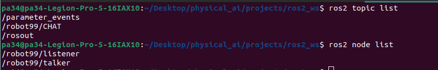
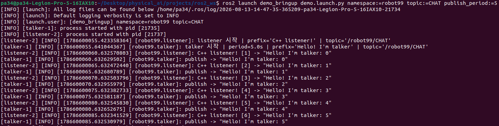
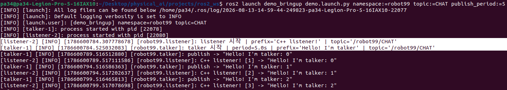

# 🗓️ TIL: LifeCycle과 Composition 및 talker-launch 실습

## 오늘 배운 것

-  **강의자료**: [15강] LifeCycle_Composition과 빌드 실행
-  launch 실습

### [15강] LifeCycle_Composition과 빌드,실행
-  **Lifecycle Node 상태 전이**

| 상태 | 설명 |
|---|---|
| Unconfigured | 초기 상태 |
| Inactive | 자원 확보 완료, 대기 상태 |
| Active | 실제 동작 중 |
| Finalized | 종료 |
	- 순서: Unconfigured (초기) → `configure()` → Inactive (설정 완료, 대기) → `activate()` → Active(실제 동작)
	- `deactivate()`: 다시 대기
	- `shutdown()`: 종료
	- 목적: 시작 순서 제어, 안전하게 정지 후 재시작, 자원 관리
	- Nav2: Lifecycle Node 구조로 구성됨 (전체 주행 스택을 관리되는 상태로 일괄 기동, 정지시킴)


- **Composition**
	-  여러 노드를 하나의 프로세스에 함께 올리는 기법
	-  같은 프로세스 안의 노드끼리는 **메모리를 직접 공유**하여 복사 없이 데이터를 주고 받음
		→ 속도 ↑

|           | 독립 프로세스                 | Composition          |
| --------- | ----------------------- | -------------------- |
| **견고성**   | 높음 (노드 하나가 죽어도 격리되어 있음) | 낮음 (같이 죽음)           |
| **통신 비용** | 복사 · 직렬화                | 메모리 공유 (카피 X)        |
| **적용 대상** | 일반적인 노드                 | 대용량 데이터를 주고 받는 노드 그룹 |


---

### 실습
 -  워크스페이스 구조
```
ros2_ws/
├── build/          # 자동 생성
├── install/        # 자동 생성
├── log/            # 자동 생성
└── src/
    ├── demo_bringup/            # bringup 패키지 (ament_cmake)
    │   ├── config/
    │   │   └── params.yaml      # 파라미터 정의
    │   ├── launch/
    │   │   └── demo.launch.py   # talker+listener 동시 기동
    │   ├── CMakeLists.txt
    │   └── package.xml
    │
    ├── demo_cpp_pkg/            # C++ 패키지 (ament_cmake)
    │   ├── src/
    │   │   └── listener.cpp
    │   ├── CMakeLists.txt
    │   └── package.xml
    │
    └── demo_py_pkg/             # Python 패키지 (ament_python)
        ├── demo_py_pkg/
        │   ├── __pycache__/
        │   ├── __init__.py
        │   └── talker.py
        ├── resource/
        │   └── demo_py_pkg      # ament_python 마커 파일
        ├── package.xml
        ├── setup.cfg
        └── setup.py
```


---

### colcon 빌드 명령어 정리

| 명령                                            | 설명                       |
| --------------------------------------------- | ------------------------ |
| `mkdir -p ~/ros2_ws/src`                      | 워크스페이스 폴더 구성             |
| `cd ~/ros2_ws`                                | 워크스페이스 루트로 이동            |
| `colcon build`                                | 전체 패키지 빌드, 의존성 순서 자동 결정  |
| `colcon build --packages-select demo_bringup` | 지정 패키지만 빌드               |
| `source install/setup.bash`                   | 빌드 결과 실행 환경 등록 (필수)      |

- package.xml의 의존성 선언 기준으로 빌드 순서 결정
- `colcon build`로 빌드가 성공하면 결과물은 `install/`에 위치
-  source 안 하면 `ros2 run`이 실행 파일을 못 찾음 

-  심화
	-  ament_cmake
		-  C++ 또는 인터페이스 패키지로, **CMakeLists.txt**로 빌드
		-  rclcpp 노드, 커스텀 인터페이스에 적합
	-  ament_python
		-  순수 Python 패키지로, **setup.py**로 빌드
		-  rclpy 노드에 적합

---

### 실습 - talker.py 작성

**구조**
- `Talker` 노드, `chatter` 토픽에 `std_msgs/String` 발행
- `declare_parameter`로 `publish_period`, `message_prefix` 선언
- `get_parameter(...).value`로 실행 시점 값을 타이머 주기·메시지 내용에 반영
-  타이머 콜백에서 카운터 증가시키며 `"{prefix}: {count}"` 형식으로 발행

```python
self.declare_parameter('publish_period', 1.0)
self.declare_parameter('message_prefix', 'Hello World from Python')
period = self.get_parameter('publish_period').value
self._prefix = self.get_parameter('message_prefix').value
```


---

### 실습 - params.yaml (demo_bringup/config)


```yaml
/**/talker:
  ros__parameters:
    publish_period: 1.0
    message_prefix: "Hello from Python"

/**/listener:
  ros__parameters:
    log_prefix: "C++ listener"
```

-  `/**` 네임스페이스 = "어떤 namespace던 상관 없이"
-  네임 스페이스 없이 두 노드가 같은 이름을 쓰면 충돌 → 주의 필요 ⭐
-  talker(Python) · listener(C++) 파라미터를 하나의 yaml에서 통합 관리 확인


---

### 실습 — demo.launch.py (demo_bringup/launch)


**launch 인자 (DeclareLaunchArgument)**

| 인자 | 기본값 | 설명 |
|---|---|---|
| namespace | demo | 두 노드를 묶을 네임스페이스 |
| topic | chatter | 실제 사용할 토픽 이름 |
| publish_period | 1.0 | talker 발행 주기, params.yaml 값 덮어씀 |
| use_listener | true | C++ listener 노드 실행 여부 |
| log_level | info | 두 노드 공통 로그 레벨 |

**핵심 구성 요소**

| 요소 | 역할 |
|---|---|
| `FindPackageShare` + `PathJoinSubstitution` | 소스 경로가 아닌 install된 share 경로의 params.yaml 참조 |
| `ParameterValue(publish_period, value_type=float)` | launch 인자(문자열)를 노드가 기대하는 타입(double)으로 명시 변환 |
| `remappings=[('chatter', topic)]` | 코드 내 고정 토픽명을 launch 인자로 교체 |
| `IfCondition(use_listener)` | 조건부 노드 실행 (`use_listener:=false` 시 listener 미실행) |
| `PushRosNamespace(namespace)` + `GroupAction` | 그룹 안 노드에만 네임스페이스 일괄 적용 |
| `arguments=['--ros-args', '--log-level', log_level]` | 로그 레벨을 ros-args로 전달 |

**실행 명령어**
```bash
cd ~/ros2_ws
colcon build --packages-select demo_bringup demo_py_pkg demo_cpp_pkg
source install/setup.bash

ros2 launch demo_bringup demo.launch.py
ros2 launch demo_bringup demo.launch.py --show-args
ros2 launch demo_bringup demo.launch.py publish_period:=5 namespace:=robot99
ros2 launch demo_bringup demo.launch.py use_listener:=false log_level:=debug
```

**확인 사항**
- params.yaml 값이 아닌, 터미널에서 넘긴 launch 인자 값이 최종 반영됨
	-  우선순위: 터미널 입력 인자 > yaml 파일 > 코드 기본값
	
-  터미널로 인자 값 변경 후, topic과 node 확인
	

- `use_listener:=false` 시 listener 노드 미실행 확인

-  publish/receive 로그 순서 뒤바껴서 출력됨 (listener가 들었다 → talker가 말했다)
		
	- talker.py에서 로그 출력을 publish() 호출 앞으로 옮겨 해결
	
-  하지만 talker(Python)와 listener(C++) 노드 시작 로그 순서에 여전히 문제 있었음
	- listener가 talker보다 약 0.2초 먼저 초기화됨
		
	- Python 인터프리터 구동과 rclpy import 지연 때문으로 보임


---

## 다음에 할 것

- talker를 cpp로 구현해보자
	- 진짜 python 인터프리터 구동과 import 지연 때문인지 확인해보자
- 패키지 빌드, 실행에 익숙해지기