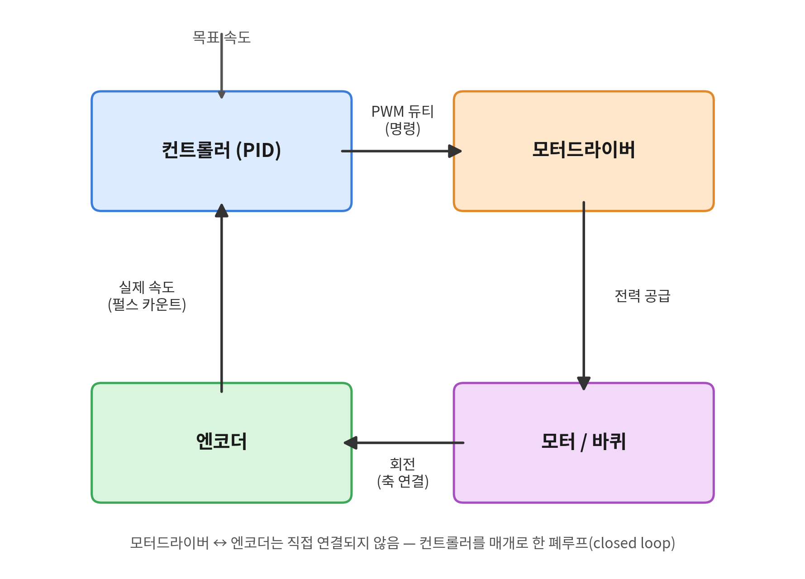
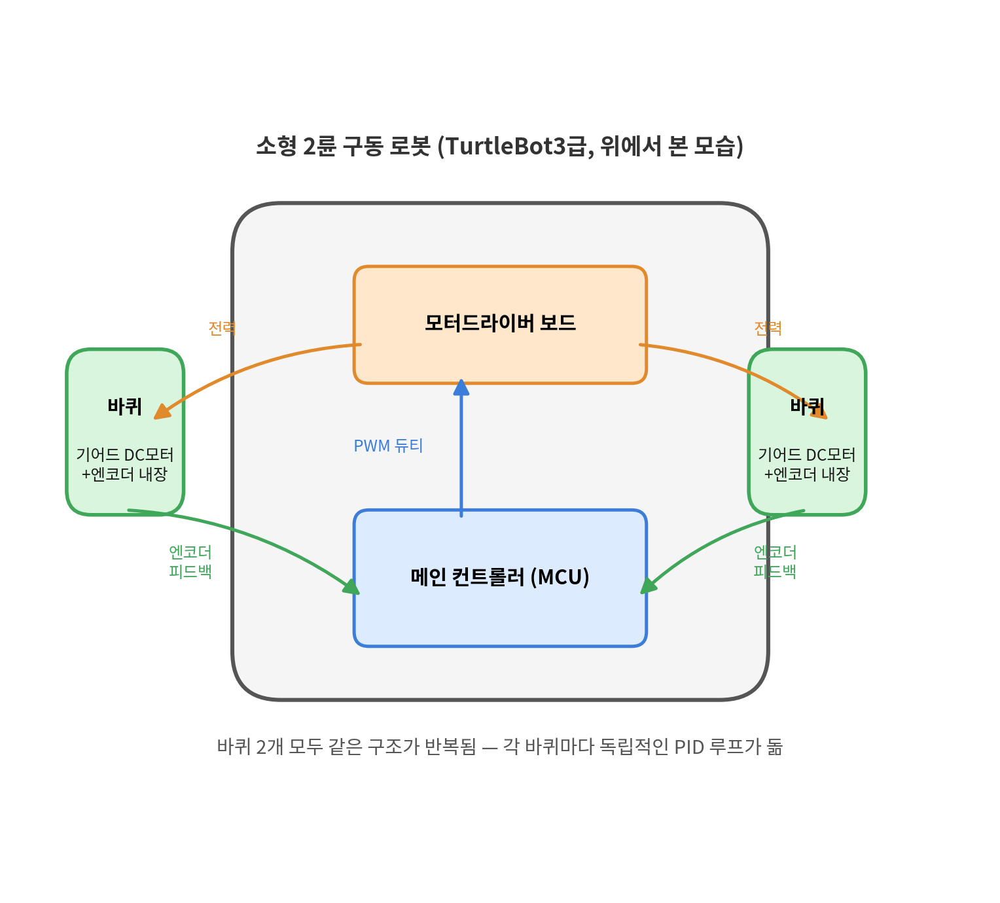

# 🗓️ TIL: level1 과제 수행 (모듈 1_과제1)

- **과제 자료**: 모듈 1 과제 — 배달 로봇 온보딩 (1~4강 범위), 문제 1 - 배달 로봇의 연산 분담과 실시간성 설계

## 핵심 키워드

#실시간성 #멀티레이트 #모터드라이버 #엔코더 #PID

### 오늘 한 것

일단 모듈 1의 문제 1 보고서 작성을 완료했다. 문제 1의 보고서 내용이 제일 쓸 말이 많은 듯하다.
과제 내용을 다 적기는 애매한 것 같으니, 오늘 한 것 중 내가 기록으로 남길만한 부분이나 헷갈렸던 부분 위주로 정리했다.

#### 멀티레이트 흐름도 만들기
- 멀티레이트 흐름도를 만들기위해서 linux에서 작업할 수 있는 ppt같은 환경이 필요했다
  → 피그마에서 하려고 들어갔더니, 이상하게 한글이 자꾸 중복으로 쳐지는 오류가 나왔다.. 예를 들면 카메라라고 타이핑하면 캄카멜메라 라고 나왔다
  → 찾아보다가 무료로 이용할 수 있는 draw.io를 찾았다 (클로드와 함께 찾았다, Thanks 클로드)
- 인터넷 사이트에 draw.io를 검색하면 간단히 도식을 만들 수 있는 사이트가 나온다!

#### 모터드라이버 vs 엔코더

**모터드라이버**
- 컨트롤러가 계산한 PWM 듀티(명령)를 받아 모터에 실제 전력을 공급하는 구동 장치

**엔코더**
- 모터/바퀴 축의 실제 회전을 펄스로 측정해 컨트롤러에 전달하는 센서

⭐ 모터드라이버와 엔코더는 서로 직접 정보를 주고받지 않음 
- 둘 다 컨트롤러(제어 루프)를 매개로 연결됨
	- **엔코더 → 컨트롤러**: 실제 속도(펄스 카운트) 전달
	- **컨트롤러**: 목표 속도 - 실제 속도로 오차 계산 → PID로 PWM 듀티 산출
	- **컨트롤러 → 모터드라이버**: PWM 듀티 명령 전달
	- **모터드라이버 → 모터/바퀴**: 전력 공급 → 모터 회전
	- **모터 회전 → 엔코더가 다시 측정** (폐루프)

(PWM: Pulse Width Modulation | PWM 듀티는 일정한 주파수로 On/Off를 반복하는 사각파에서 한 주기 중 On(High) 상태가 차지하는 비율로, 듀티 비율이 클수로 모터에 걸리는 평균 전압 및 전력이 커져 더 빠르게 회전)

---

## 느낀점

- 과제하다보니 시간이 후다닥 지나갔다. 이번주 안에 모듈 2까지 다 해야지!
- 내일은 모듈 1 마무리를 목표로 해야겠다.
