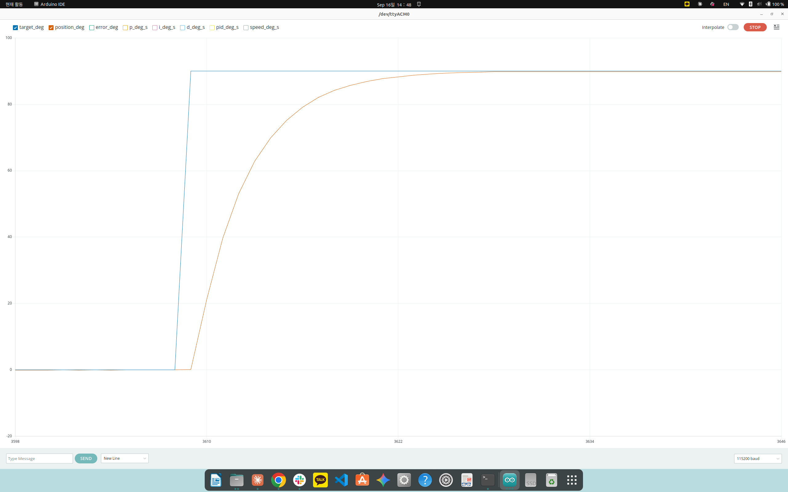
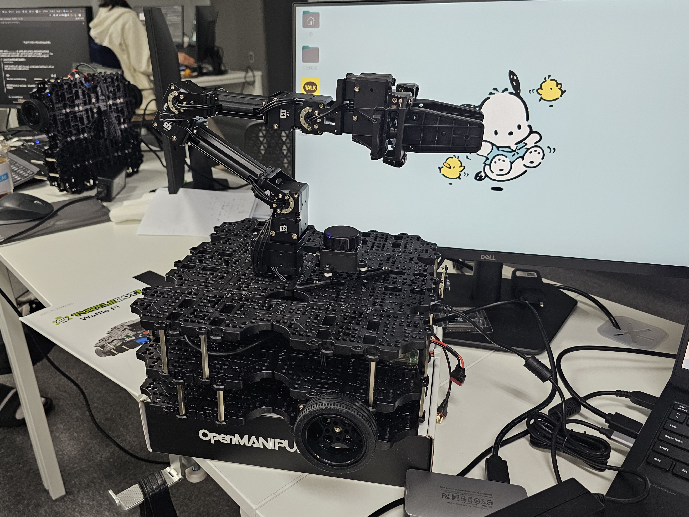
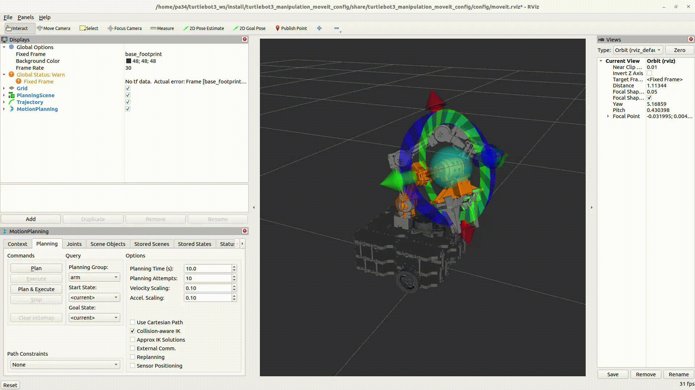

# 🗓️ TIL: Ziegler-Nichols PID 튜닝 검증과 TurtleBot3 Manipulator 브링업

### 핵심 키워드

#PID #Ziegler-Nichols  #터틀봇 #Manipulation #MoveIt

---

## 오늘 배운 것

### Ziegler-Nichols 폐루프 PID 튜닝 실험

- **실험 목적**
	- 9/15 수동 탐색으로 찾은 Kp=3.4/Ki=0.01/Kd=0.2(v_limit=60, 오버슈트 0%)와 Z-N 폐루프법으로 구한 이론적 게인을 비교

- Z-N 실측 
	1) Ki와 Kd는 고정한 후, Kp만 올리면서 지속진동하는 Kp를 찾음
		- Ku=30, Tu=2.25s
	2) Z-N 공식 적용
		- Kp = 18, Ki = 16, Kd = 5.0625

**스케일별 결과 (v_limit=60, target=90deg)**

| 스케일  | Kp/Ki/Kd             | 결과          | 오버슈트(%) |
| ---- | -------------------- | ----------- | ------- |
| 50%  | 9 / 8 / 2.5313       | 오버슈트 후 수렴   | 4.20    |
| 60%  | 10.8 / 9.6 / 3.0375  | 오버슈트 후 수렴   | 3.81    |
| 70%  | 12.6 / 11.2 / 3.5438 | 오버슈트 후 미세진동 | 3.61    |
| 100% | 18 / 16 / 5.0625     | 오버슈트 후 감쇠진동 | 2.73    |

- **예상과 반대로 결과가 나와서 이상하다 생각함**
	- 이론상으로는 100%(Z-N PID)가 Kp값이 가장 커서 가장 큰 오버슈트를 낼 것이라고 생각했으나, 실측에서는 스케일이 커질수록 오버슈트가 오히려 줄어드는 것으로 관찰됨

**원인: 출력 속도 limit (v_limit)**

- 튜터님께서 주신 코드상으로 출력이 v_limit(=60deg/s)로 클리핑됨
- `Kp × error`가 v_limit을 넘는 상승 구간에서는 모든 게인 조합이 동일하게 클리핑됨
  따라서, **상승 속도/타이밍이 게인과 무관하게 v_limit에 의해 결정됨** 😢
  실제로 확인한 결과, Z-N의 50~100% 모두 오버슈트 피크 도달 시각 t_s ≈ 4.7~4.8s로 거의 동일

**v_limit=max로 풀고 다시 검증**

- speed에 `max` 입력 시 v_limit=INFINITY로 설정되지만, 모터 하드웨어 자체 한계(EEPROM VELOCITY_LIMIT raw=330 → 약 453.4deg/s)까지는 여전히 걸림
- **Kp = 3.4, Ki = 0.01, Kd = 0.2가 v_limit = max, degree = 90에서 최적의 결과 출력**
	- 오버슈트 없이 수렴, 정착시간 1.9s (v_limit = 60일 때 2.9s보다 단축)
	- t = 2.0s 시점 u_deg_s=306.4로 하드웨어 한계(453.4)보다 작아 이번에는 클리핑 없는 순수 선형 PID 동작임을 확인

**결론**

- Z-N 폐루프법은 오버슈트를 어느 정도 허용하는 1/4 감쇠비 기준으로 도출된 공식이라, 최적해가 아니라 손으로 미세조정하기 전 러프한 시작점 수준임
- 미세조정을 통해 Kp, Ki, Kd를 조정해야함

---

### OpenCR + TurtleBot3 Manipulation 브링업 트러블슈팅

- **OpenCR 펌웨어 업데이트 환경 제약**
	- armhf 라이브러리는 x86_64 노트북이 아닌 SBC(라즈베리파이)에서 설치해야 함 (`archive.ubuntu.com`은 armhf 미지원, SBC용 `ports.ubuntu.com`을 쓰는 환경에서만 정상 설치됨)
	- SBC IP는 DHCP로 매번 바뀜 → `arp-scan`/`nmap -p 22 --open`으로 MAC 주소 기준 재탐색 가능

**다이나믹셀 구성**

| 구분  | 모델         | ID    | 비고                                      |
| --- | ---------- | ----- | --------------------------------------- |
| 바퀴  | XM430-W210 | 1, 2  | -                                       |
| 팔   | XM430-W350 | 11~15 | 데이지체인 구조 → OpenCR 빈 DXL 포트 아무 곳에나 연결 가능 |

- OpenCR-DXL 통신 baud rate: `1000000`(1Mbps)

**브링업 중 발견한 버그/충돌**
**1) `hardware.launch.py` 실행 시 `UnboundLocalError: lidar_launch`**
- 원인: `LDS_MODEL=LDS-03`(COIN D4)인데 launch 파일에 LDS-01/LDS-02 분기만 있고 LDS-03 분기 누락
- 해결: `turtlebot3_bringup`의 `robot.launch.py`에서 LDS-03 처리 방식(`coin_d4_driver`, `single_lidar_node.launch.py`) 확인 후, 같은 분기를 `hardware.launch.py`에 직접 추가
- 이후 `colcon build --symlink-install`로 재빌드해서 `install`과 `src` 동기화

**2) `moveit-task-constructor-core` apt 설치 충돌**
- 원인: `moveit-py`와 동일한 파일(`moveit/__init__.py`)을 서로 설치하려다 dpkg 충돌 발생
- 해결: `sudo apt-get -o Dpkg::Options::="--force-overwrite" install ros-humble-moveit-task-constructor-core` 후 `apt --fix-broken install` (강제로 overwrite시킴)

**브링업 시 `stack smashing detected`로 팔 제어 프로세스 강제 종료**
- 원인: DYNAMIXEL 모터의 `Return Delay Time`(기본 250~500us)이 길어서 ROS2 controller가 응답을 기다리다 타임아웃 → 버퍼 오버플로우로 이어짐
	- [참고] 동일증상 확인: GitHub ROBOTIS-GIT/turtlebot3 issue #1042, https://github.com/ROBOTIS-GIT/turtlebot3/issues/1042
- 해결 과정
	1. OpenCR을 USB-DXL 브릿지로 임시 전환 (USB로 OpenCR을 PC에 연결한 상태 2번 진행)
	2. OpenCR에 Arduino IDE로 `usb_to_dxl` 예제 업로드 (`File > Examples > OpenCR > 10.Etc > usb_to_dxl`
	3. DYNAMIXEL Wizard 2.0를 설치한 후 검색 버튼을 눌러 팔 모터(ID 11~15) 전부 스캔
	4. 다이나믹셀 ID 11~15번의 `Return Delay Time`을 500 → 0으로 변경 후 저장
	5. OpenCR을 SBC로 재연결, `turtlebot3_manipulation.opencr` 펌웨어로 재업로드
	6. `hardware.launch.py` 재실행 → 에러 없이 정상 기동 확인 (빨간 경고 하나 뜨긴 하지만 정상 작동함)

**MoveIt RViz 조작 방식**
- Planning 탭: end-effector 위치 기준 IK로 동작 시키기
	- plan, execute를 통해 실행 test 수행
- Joints 탭: 개별 조인트를 직접 움직임
	- 여기서 맞춘 자세를 Planning 탭의 Goal State로 하여 Plan/Execute 가능

---

### 매니퓰레이터 세팅 & MoveIt 플랜·실행 테스트

- TurtleBot3 Waffle Pi 베이스 위에 OpenMANIPULATOR-X 팔 장착 완료 (모터 ID 12/13/14 라벨 육안 확인)

- MoveIt RViz의 Planning 탭에서 `arm` 플래닝 그룹에 대해 interactive marker(컬러 링, end-effector 기준 IK)로 목표 자세를 지정하고 Plan 실행
	- 이 시점 `Global Status: Warn — No tf data` 경고가 떠 있었음 (TF 트리가 아직 완전히 연결되지 않은 상태로 추정됨)

- Plan & Execute로 RViz에서 계획한 궤적을 실제 로봇 팔로 실행 → 시뮬레이션(RViz)과 동작이 동기화되는 것 확인 ⭐

---

## 알게 된 것

- Z-N 폐루프 이론값은 굉장히 rough함
- v_limit이 걸린 구간에서는 게인과 무관하게 출력이 클리핑되어 상승 속도가 v_limit만으로 결정됨
- v_limit = max로 풀면 모터 하드웨어 자체 한계(약 453deg/s)까지만 걸려 순수 선형 PID로 동작)
  → 오버슈트 없이 수렴하는 값을 찾음

---

## 느낀점

- TurtleBot3 Waffle Pi + OpenMANIPULATOR-X 브링업 완료
- MoveIt RViz의 Plan & Execute로 시뮬레이션-실기 동기화 확인
- 실습 재밌었다, 좀 더 다른 task도 해봐야지
