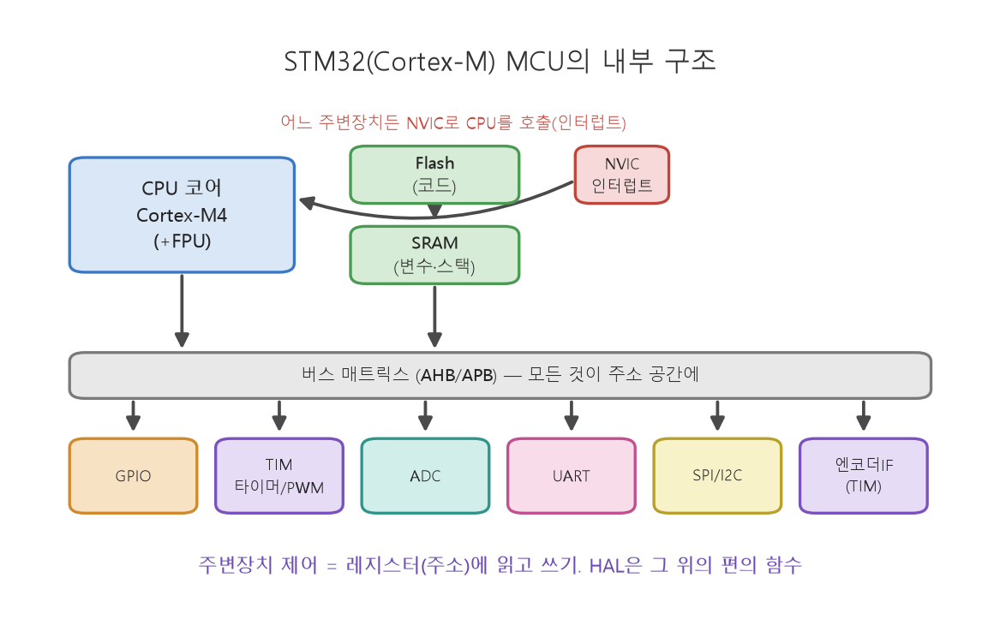

# 🗓️ TIL: Cortex-M MCU 구조와 GPIO·인터럽트

### 핵심 키워드

#CortexM #MCU #GPIO #인터럽트 #ISR

---

## 오늘 배운 것

- **강의자료**: 4강 1~3장 (Cortex-M MCU 구조, GPIO, 인터럽트)

### 1. Cortex-M MCU의 구조와 메모리맵

- **MCU 구성**
	- 어떤 주변 장치든 NVIC를 통해 CPU를 인터럽트로 호출 가능
	- 정의된 핀맵에 맞게 조심해서 다뤄야 동작함 → 핀 배치를 틀리면 안 됨 ⭐
	- SBC (라즈베리파이 등)는 SW 담당 (운영체제 필요, 다양한 언어, 확장성·설치 자유) / MCU는 HW 담당 (지정된 하나의 목적 — 센서 처리, 주기 제어, 구동 신호)

| 구분      | PC/SBC             | MCU                     |
| ------- | ------------------ | ----------------------- |
| 클럭      | GHz대               | 수십 ~ 수백 MHz             |
| 메모리     | GB (DRAM)          | KB~MB (SRAM + Flash)    |
| OS      | 리눅스                | 없음(bare-metal) or  RTOS |
| 인터럽트 지연 | 수십µs~ms, **가변**    | 수백ns, **결정적**           |
| 부팅      | 수십 초               | 수 ms                    |
| 역할      | 인지, 판단 (Soft/Firm) | 제어 (Hard 실시간)           |

- **Memory-mapped I/O** ⭐
	- 주소 영역 `0x0800 0000`, Flash - 코드 저장, 프로그램과 상수 저장, 전원 없어도 보존
	- 주소 영역 `0x2000 0000`, SRAM - 전역/지역 변수, 스택
	- 주소 영역 `0x4000 0000`, 주변장치 레지스터 - GPIO, 타이머, ADC 설정/데이터
	- 주소 영역은 2진수, 16진수 이용

### 2. GPIO

- **출력/입력 모드**
	- 출력: 핀을 High(3.3V)/Low(0V)로 → LED, 릴레이, 모터 드라이버 방향(DIR) 핀
	- 입력: 핀 전압을 0/1로 읽음 → 버튼, 리밋 스위치, 엔코더 신호
		- 엔코더
			- 광학 센서: 디지털 입력 (더 정확, 자기장의 영향을 받지 X)
			- 물리적 연결: 아날로그 입력

- **풀업/풀다운**
	- 아무것도 연결 안 된 입력 핀은 전압이 floating (0과 1 사이 요동)
	- 내부 저항으로 기본값을 High (풀업) 또는 Low (풀다운)로 고정

### 3. 인터럽트

- **폴링 vs 인터럽트**
	- 폴링
		- `while(1){ if(버튼눌림){...} }` 
		- <u>단순하지만 CPU를 독점하고, 다른 일 하는 동안 이벤트를 놓칠 수 있음</u>
	- 인터럽트
		- 하드웨어가 이벤트를 감지하면 CPU가 하던 일을 멈추고 등록된 ISR(Interrupt Service Routine)로 점프했다가 복귀
		- 이벤트 발생 시 NVIC가 즉시 ISR 호출(수백 ns, 결정적)

- **ISR 작성 규칙**
	- ISR은 짧게, 플래그나 값 저장만 하고 즉시 리턴
	- `printf`·지연·무거운 계산 X (그동안 다른 인터럽트, 특히 제어 루프 타이머가 밀릴 수 있음)
	- 우선순위는 NVIC가 관리하며 제어 루프 타이머에 가장 높은 우선순위를 줌

- ROS2 9강 콜백과 같은 사고방식 (이벤트가 오면 이 함수를 부르도록)
  차이는 규모 → ROS2 콜백은 ms 세계의 소프트웨어 event, ISR은 ns 세계의 하드웨어 event

---

## 알게 된 것

- memory-mapped I/O 구조에서는 레지스터 조작이 곧 메모리 접근 - HAL 함수도 결국 같은 주소에 값을 쓰는 것
- 풀업/풀다운 미설정 시 플로팅 전압으로 인한 유령 입력 버그 발생
- 인터럽트는 반응이 **결정적**(수백 ns)이라 **Hard 실시간 제어에 적합**, ISR은 짧게 짜야 함 ⭐

---

## 느낀점

- 프로젝트 2번 아이디어 구상에 들어갔다. 로봇을 어떻게 만들지부터 결정해야하는데, 결정할게 너~무 많다!
